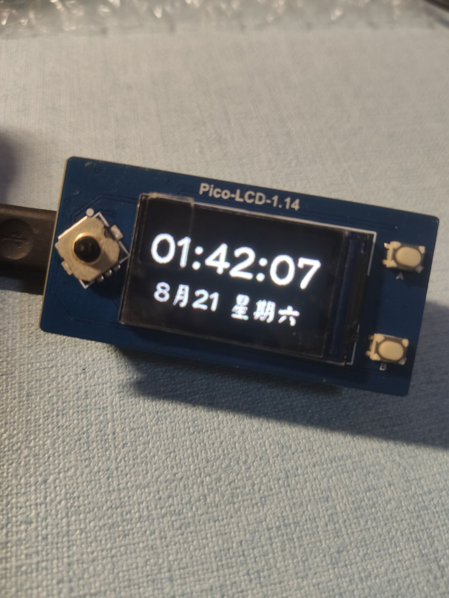

# pico_watch
\
raspberry Pico + FreeRTOS + Lwip + Lvgl\
电子时钟，电脑上配置好网络后，通过usb接到电脑后可以自动通过ntp服务器同步网络时间。\
\
\
屏幕：[微雪1.14寸LCD](https://www.waveshare.net/shop/Pico-LCD-1.14.htm)

功能：
* 显示时间（时分秒）、日期和星期几
* 通过网络自动同步时间
* 可交互shell,通过命令查看设备信息，支持串口和tcp访问
* 远程IO,通过tcp将本机的stdio重定向到网络，方便进行远程调试(不需要接串口线)

远程shell的效果如下：
```
hunter@debpc:~$ nc 10.0.0.3 63

Welcome to shell!
Type 'h' to find usage
# h
all commands:
[task_regs]: show specific task's register content
[rotate_screen]: rotate screen 180 degree
[uptime]: show how long does the device running
[flash]: reboot device to flash mode for update fireware
[reset]: reset the whole device
[set_datetime]: set current datetime
[task_list]: show task info
[heap_stat]: show heap memory usage
[help]: show command usage, eg: help set_datetime
[h]: show all commands
--------------[success]--------------

# task_list
shell          	X	2	388	3
IDLE           	R	0	230	2
network        	B	2	605	1
input          	B	2	703	5
gui            	B	2	644	4

--------------[success]--------------

# uptime
uptime:  0 days 0 hours 10 minutes 25 seconds
--------------[success]--------------

# task_regs gui
psr: 0x 61000200
 pc: 0x 2000028e
 lr: 0x 100335d9
r12: 0x 20000285
r03: 0x 0000001c
r02: 0x 000001e0
r01: 0x 2000d00a
r00: 0x 40040000
--------------[success]--------------

# 

```
